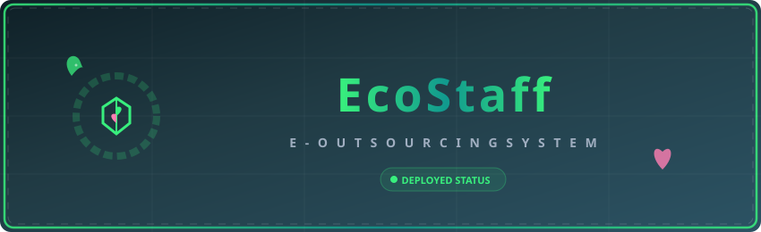
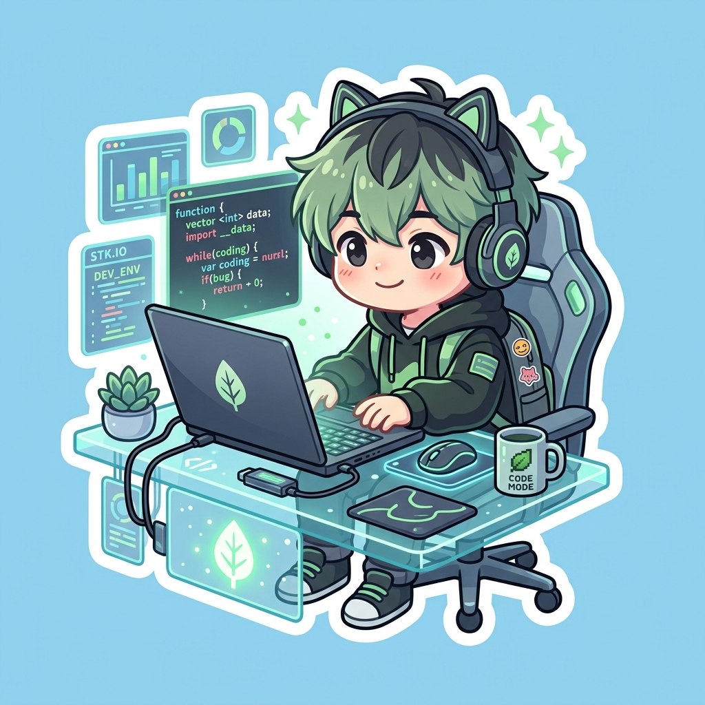

<!-- Animated SVG Header Banner -->

  

 

  
  
  
  

<!-- Animated SVG Divider -->

  

 

<!-- Section: Welcome with Cute Anime Welcome Sticker -->
<table border="0" width="100%" cellspacing="0" cellpadding="10">
  <tr style="border: none;">
    <td width="70%" style="border: none; vertical-align: middle;">
      <h2>🌸 Konnichiwa! Selamat Datang di EcoStaff 🌸</h2>
      

        <b>EcoStaff</b> adalah sistem manajemen <i>E-Outsourcing</i> modern yang dirancang untuk mengelola penjadwalan, perizinan, lembur, dan absensi karyawan secara real-time. Dengan antarmuka yang bersih, responsif, dan alur kerja yang terstruktur berdasarkan peran pengguna.
      

      
<i>"Mengelola staf kini menjadi jauh lebih estetis dan efisien! Mari kita bangun tim yang solid bersama-sama! ~ 💫"</i>

    </td>
    <td width="30%" align="center" style="border: none; vertical-align: middle;">
      
    </td>
  </tr>
</table>

<!-- Animated SVG Divider -->

  

 

### 🚀 Link Deploys Aplikasi
Aplikasi ini telah berhasil dideploy dan dapat diakses secara publik melalui link berikut:
👉 **[https://ecostaff.ct.ws](https://ecostaff.ct.ws)**

> [!NOTE]
> Anda dapat mencoba login dengan role yang diinginkan untuk melihat fitur-fitur interaktif di dalamnya secara langsung!

 

<!-- Animated SVG Divider -->

  

 

<!-- Section: Roles with Mascot Sticker -->
<table border="0" width="100%" cellspacing="0" cellpadding="10">
  <tr style="border: none;">
    <td width="30%" align="center" style="border: none; vertical-align: middle;">
      
    </td>
    <td width="70%" style="border: none; vertical-align: middle;">
      <h3>🛡️ Guild Ranks (Peran Sistem / Users)</h3>
      
Sistem ini menggunakan pembagian peran (roles) layaknya sistem faksi pada anime untuk menjaga keamanan dan efisiensi koordinasi:

      <ul>
        <li>👑 <b>Rank SS - Super Admin:</b> Memegang kontrol tertinggi atas seluruh konfigurasi sistem, parameter global, dan hak akses penuh.</li>
        <li>🛠️ <b>Rank S - Admin Outsourcing:</b> Mengelola onboarding karyawan baru, validasi pengajuan akun, dan koordinasi dengan vendor luar.</li>
        <li>👔 <b>Rank A - Kepala Departemen:</b> Mengatur plotting jadwal shift mingguan, menyetujui lembur (overtime), dan melacak laporan performa divisi.</li>
        <li>📊 <b>Rank B - HR User:</b> Memverifikasi ajuan data karyawan, mengunduh rekap detail kehadiran, dan memantau kesehatan operasional.</li>
        <li>🏃‍♂️ <b>Rank C - Karyawan Outsourcing:</b> Mengisi absensi harian, mengajukan izin/cuti, melihat jadwal shift pribadi, dan mengunduh jadwal dalam format PDF.</li>
      </ul>
    </td>
  </tr>
</table>

---

### 🎮 Fitur Utama & Interaktif

Gunakan menu di bawah ini untuk melihat fitur-fitur seru dari setiap faksi:

<b>👑 Fitur Super Admin (Rank SS)</b> [Klik untuk buka]

 

- **Dashboard Admin:** Statistik visual jumlah seluruh pengguna, status server, dan notifikasi log sistem.
- **Pengaturan Global:** Mengatur preferensi sistem, data departemen, dan aturan default outsourcing.
- **System Monitoring:** Mengawasi aktivitas user dan audit trail untuk keamanan data.

<b>🛠️ Fitur Admin Outsourcing (Rank S)</b> [Klik untuk buka]

 

- **Kelola Karyawan:** Menambah, memperbarui, dan menonaktifkan data karyawan outsourcing yang masuk ke sistem.
- **Pengajuan Akun & Karyawan:** Melakukan approval terhadap pendaftaran akun baru secara instan.
- **Departemen API Integration:** Sinkronisasi data departemen dengan vendor penyedia tenaga kerja.

<b>👔 Fitur Kepala Departemen (Rank A)</b> [Klik untuk buka]

 

- **Sistem Penjadwalan Cerdas:** Plotting jadwal shift karyawan secara interaktif dengan antarmuka kalender.
- **Template & Export Excel:** Unduh template jadwal kosong dan lakukan ekspor jadwal tim dengan sekali klik.
- **Approval Pengajuan:** Menyetujui atau menolak permohonan lembur dan perizinan dari anggota divisi.
- **Atur Lokasi Absensi:** Menentukan titik koordinat GPS kantor/lapangan untuk pembatasan absensi karyawan.

<b>📊 Fitur HR User (Rank B)</b> [Klik untuk buka]

 

- **Dashboard HR Komprehensif:** Visualisasi metrik kehadiran karyawan, pengajuan lembur aktif, dan rasio kehadiran.
- **Rekapan Detail & Ajuan Data:** Memeriksa kesesuaian berkas identitas karyawan, NIP/NIM, dan validasi seeder.
- **Data Vendor & Karyawan API:** Sinkronisasi API untuk menyajikan laporan real-time ke pihak manajemen.

<b>🏃‍♂️ Fitur Karyawan Outsourcing (Rank C)</b> [Klik untuk buka]

 

- **Interactive Personal Dashboard:** Informasi shift hari ini, jam masuk, jam pulang, dan sisa kuota cuti.
- **Pengajuan Perizinan & Lembur:** Form pengajuan izin sakit, cuti tahunan, atau klaim jam lembur ekstra.
- **Download Jadwal PDF:** Fitur unduh kalender shift kerja pribadi dalam format PDF siap cetak.

 

<!-- Animated SVG Divider -->

  

 

### 🎨 Tech Stack & Tools
Proyek ini dibangun menggunakan teknologi mutakhir untuk memastikan performa yang cepat dan pengalaman pengguna yang luar biasa:

* **Backend Framework:** [Laravel 10.x](https://laravel.com) - *Elegant PHP Web Framework* 🐘
* **Frontend Reactivity:** [Livewire v3](https://livewire.laravel.com) - *Dynamic Reactive Frontend for Laravel* ⚡
* **Styling System:** [Tailwind CSS v3](https://tailwindcss.com) - *Utility-First CSS Framework for Aesthetic Designs* 🎨
* **Database Engine:** MySQL - *Relational Database Storage* 💾
* **Bundler & Server:** [Vite](https://vitejs.dev) - *Super-fast frontend tooling* 🚀
* **PDF Generator:** [DomPDF](https://github.com/barryvdh/laravel-dompdf) - *Convert HTML views to neat PDF files* 📄

 

<!-- Animated SVG Divider -->

  

 

<!-- Section: Local Setup with Dev Sticker -->
<table border="0" width="100%" cellspacing="0" cellpadding="10">
  <tr style="border: none;">
    <td width="70%" style="border: none; vertical-align: middle;">
      <h3>⚙️ Cara Menjalankan Proyek Secara Lokal</h3>
      
Ingin mencoba menjalankan di komputer Anda? Ikuti langkah-langkah mudah berikut:

      <ol>
        <li><b>Clone Repositori:</b> <code>git clone https://github.com/username/E-outsourcing-trpl210.git</code></li>
        <li><b>Instal Dependensi PHP & Node:</b> <code>composer install</code> dan <code>npm install</code></li>
        <li><b>Konfigurasi Environment:</b> Salin berkas <code>.env.example</code> ke <code>.env</code> dan generate key dengan <code>php artisan key:generate</code></li>
        <li><b>Migrasi Database &amp; Seeder:</b> <code>php artisan migrate:fresh --seed</code></li>
        <li><b>Jalankan Server:</b> Buka server lokal dengan <code>php artisan serve</code> dan compiler dengan <code>npm run dev</code></li>
      </ol>
    </td>
    <td width="30%" align="center" style="border: none; vertical-align: middle;">
      
    </td>
  </tr>
</table>

 

<!-- Animated SVG Divider -->

  

 

  
Dibuat dengan penuh dedikasi dan cinta 💚 oleh Tim EcoStaff.

  
<i>~ Arigatou Gozaimasu! ~</i>

  

